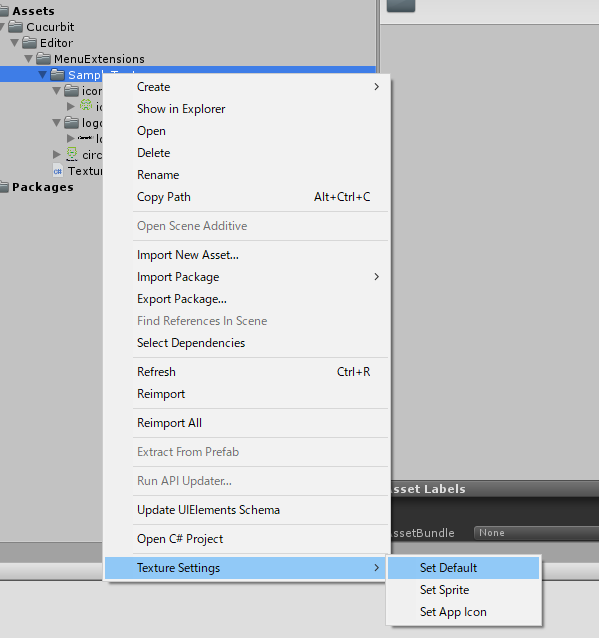

# Menu Extension For Texture Settings

Menu Extension For Texture Settings is a menu extension for easily setting textures from the right-click menu.

## Features
- You can select and process multiple textures at once.
- You can select a directory and process all the textures contained in it.

## Install
1. Download latest menu-extension-for-texture-settings_vX.X.X.unitypackage from this link.
https://github.com/Accky/MenuExtensionForTextureSettings/releases
2. Import menu-extension-for-texture-settings_vX.X.X.unitypackage to your project.

## Usage
1. Select the texture whose texture type you want to change from [Project View] and right click. (Single / Group / Directory)
2. Select **[Texture Settings]** at the bottom of the context menu.
3. Select one of the menus **[Set Default] [Set Sprite] [Set App Icon]**.
   - **[Set Default]** : Set Texture Type to [Default].
   - **[Set Sprite]** : Set Texture Type to [Sprite (2D and UI)].
   - **[Set App Icon]** : Set Texture Type to [Editor GUI and Legacy GUI]. App Icon will be jaggy if this Type is not set.

## Operation confirmed
- Unity 2018.4.10f1
- Visual Studio 2019 Community